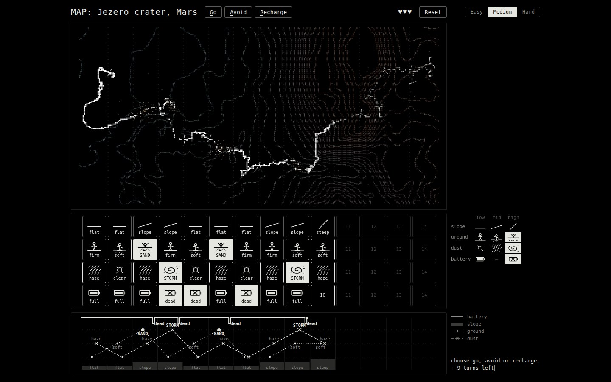

# Rover Run: Rulebook v2 & State of Play

Oct 6, 2026 · @beeps

The original handoff is [rulebook.md](rulebook.md). This v2 records what the game has become
after a day of building, simulation and blind playtests. The code is `src/`, the facilitator
exercise is [INDICATORS.md](../../narrative/INDICATORS.md), and the design history is
[chronology/2026-10-04-rover-run.md](../../chronology/2026-10-04-rover-run.md).

## Overview

Rover Run is a card-and-map game about **finding the indicators of a bad outcome and building a
model from them**. Teams drive a rover across 14 squares of the real Perseverance route on Jezero
crater. Each square has four cards, and three things can end the run: a sand pit, a dust storm,
or a dead battery. Nobody explains the rules. The cards are the data, and the room works out what
predicts what.

*Medium mode, deciding square 10.*
- **Map:** the 14 strips of the real map, the rover's route so far, and square 10's strip ahead.
- **Cards:** each column sits under its strip. Square 10 shows its slope, ground and dust; its
  battery is still hidden.
- **Graph:** one line per variable, so soft → SAND and haze → STORM line up.
- **Top bar:** three lives (♥).

- **Event version:** 5–10 players as 2–3 teams plus a facilitator, about 30 minutes. Every card is a
  physical card, so tables need no screen.
- **Online version:** one player, the same fixed map, three lives per run, three modes.
- **Ending:** each run replays on the real Jezero map in the style of the anchor films (online now;
  all teams together at an event is planned).

## Learning goals

Each goal is carried by a mechanic, never by a lecture.

| Goal | What players should feel | Mechanic that carries it |
| --- | --- | --- |
| Outcome | Know what you are predicting | Three death conditions, each recurring on the map, each marked with a red ring when it kills |
| Indicators | A death has an earlier, visible warning | Soft ground before SAND, haze before STORM, a dead battery card after each hazard |
| Repetition | One case is an anecdote | Three sands and three storms on one fixed map |
| Correlation over time | The warning is one square ahead | One variable along the row of cards, and its line on the graph |
| Correlation across variables | Context changes what a warning means | Down a column: sand never on steep ground; storms never on flat ground |
| Models | Weak signals combine | Storm needs haze before **and** a slope: 3 of 4 together, 3 of 6 for haze alone |
| Precision | False alarms cost, misses kill | A detour scores nothing; a miss costs a life |
| Attention | You can't look at everything | Hard mode: 2 of the next square's 4 cards |

**Debrief prompts**

1. What killed you, and what was the earliest card that warned you?
2. Which warning did you learn to ignore, and what told you it was safe?
3. Your storm rule is right 3 times in 4. Did you still detour? What did the 4th case cost?
4. Write your model as one line per hazard. Does a run that follows only those lines get across?

## Components

Every team gets an identical set:

- **Strip map.** Real Jezero contours (JPL CTX DEM) and the Perseverance route (sols 14–1980),
  turned **south up** (rotated, not mirrored) so the westward drive reads left to right, and cut
  into 14 vertical strips. Lines closer together mean steeper ground.
- **Four decks, numbered 1–14, never shuffled.** Card *n* in each deck describes square *n*.

| Deck | low | mid | high |
| --- | --- | --- | --- |
| Slope | flat (a level line) | slope (a gentle incline) | steep (a steep incline) |
| Ground | firm (a figure standing) | soft (a figure sinking to the shins) | **SAND** (a figure in quicksand, arms up) |
| Dust | clear (the sun) | haze (rain falling across the sun) | **STORM** (a dust devil) |
| Battery | full | — | **dead** |

- **A turn track** with 22 spaces, **3 life tokens**, and a score sheet.

The battery card is **the battery you arrive with**. It is dead on the square right after a SAND or
STORM (the full battery went on the detour round it) and full everywhere else. So it is a plain
card that can be dealt, with no state to remember.

## Rules

**Start.** 3 lives, 22 turns, the rover before square 1, battery full.

**Each turn, do ONE thing**

| Action | Effect |
| --- | --- |
| **Go** | Drive the next square. Scores 1. If it is SAND or STORM, the rover dies. |
| **Avoid** | Detour round the next square. Scores nothing, but it is always safe. |
| **Recharge** | Stay where you are. Battery full. |

**The rover dies if**

- you Go into a **SAND** or **STORM** square, or
- you move on (Go or Avoid) from a square whose **battery card is dead** without recharging there first.

**A death costs a life.** The rover restarts on the square before, with a full battery; the turn
track keeps running. After the third death the run is over.

**Cards.** Before a move, look at the next square's cards (see the modes below). Once you are past
a square, all four of its cards turn face up.

**Score.** +1 per square you **drive through**, +3 for reaching the end. A detour scores nothing:
it is data you didn't collect.

## Modes

| Mode | Before each move you see | What it trains |
| --- | --- | --- |
| **Easy** | the whole board, face up | analysis: the indicator exercise is done here |
| **Medium** (default) | the next square's slope, ground and dust; **its battery stays hidden** until you're past | the battery is the variable to work out: dead batteries sit just after each hazard |
| **Hard** | **2 of the next square's 4 cards**, your choice | attention: ground + dust answers "is it deadly?"; slope is already on the map; battery is about the square behind |

Suggested session: a round of Medium, a round of Hard, then Easy for the exercise.

## Hidden patterns (facilitator only)

1. **SAND always follows a soft square, and is never on steep ground.** Soft before a steep square
   is a false alarm, every time (squares 10, 11, 12).
2. **STORM always follows a hazy square, and is never on flat ground.** Haze before flat is a false
   alarm (2, 7). Haze before a slope storms 3 times in 4 (4, 9, 11; not 13).
3. **The battery card is dead on the square right after each SAND or STORM** (4, 5, 7, 10, 12).

Flat ground can sand but never storm, and steep ground can storm but never sand. Middling slope can
do both.

## The deck

| Square | 1 | 2 | 3 | 4 | 5 | 6 | 7 | 8 | 9 | 10 | 11 | 12 | 13 | 14 |
| --- | --- | --- | --- | --- | --- | --- | --- | --- | --- | --- | --- | --- | --- | --- |
| Slope | flat | flat | slope | slope | flat | flat | flat | slope | slope | steep | steep | steep | slope | slope |
| Ground | firm | soft | **SAND** | firm | soft | **SAND** | firm | firm | soft | soft | soft | firm | soft | **SAND** |
| Dust | haze | clear | haze | **STORM** | clear | haze | clear | haze | **STORM** | haze | **STORM** | haze | clear | clear |
| Battery | full | full | full | **dead** | **dead** | full | **dead** | full | full | **dead** | full | **dead** | full | full |

Slope is measured from the elevation model, one value per strip. Ground, dust and battery are
authored. The deck is fixed, so a room can replicate a session on paper.

## Strategy outcomes

Simulated with `node src/tools/sim.mjs` (one life: does this way of reading the cards survive?).

| Strategy | Score | How it ends |
| --- | --- | --- |
| Look at ground + dust of the next square (Hard) | **11** | drives every safe square |
| The model: sand risk = soft before and not steep; storm risk = haze before and a slope; recharge on a dead battery | 10 | one false alarm (square 13) |
| Look at slope + battery (Hard) | 10 | battery says nothing about the square ahead |
| Avoid after haze, or after soft, ignoring slope | 8 | two needless detours |
| Avoid after any warning | 6 | four needless detours |
| Always avoid | 3 | finishes, drives nothing |
| Always go · ignore haze · never recharge | 2 | sand · storm · battery |
| Random | ~1 | |

## Event vs online

| | Event (5–10 players) | Online (1 player) |
| --- | --- | --- |
| Lives | 3 tokens per team | 3 per run |
| Modes | The facilitator chooses which cards are face up: everything (Easy), all but battery (Medium), or the team turns over 2 (Hard) | Easy / Medium / Hard buttons |
| Verification | Cards flip after each move; the team checks its guess | The same, plus the graph, matching cards (click one) and a replay |
| Ending | Teams' sheets replay together on the Jezero map (planned) | The run replays on the map |

## Data honesty

| Element | Status |
| --- | --- |
| Contour map, route, strips | Real: JPL Mars 2020 CTX DEM (20 m), NASA MMGIS traverse; rotated south up |
| Slope cards | Real, bucketed per strip (map-scale slope: flat < 2°, steep ≥ 8°) |
| Ground, dust, battery, hazards | Authored, following the patterns above |
| Battery | Simulated; Perseverance is nuclear-powered |

## State of play

**Built** (`src/`, served by `python3 space/rover-run/src/serve.py` on port 8670):
- the game (v1.11), with the three modes, three lives, the card graph, matching cards on click,
  a hover link from column to strip, Reset, and death screens;
- a strategy simulator whose checks guard every number in this rulebook;
- a film recorder and a blind-playtest harness;
- frozen earlier versions at `/v1.0/`–`/v1.5/` and the separate two-deck design at `/v2/`, kept on the
  workshop machine (not in git).

**Learned from blind agent playtests:**
- With same-deck retries and remembered cards, the first agent memorised the map instead of
  learning a pattern. That is why lives replaced retries.
- In the two-deck design (`/v2/`), with look-ahead and a rule notebook, a fresh agent wrote
  "soft and not steep → SAND" unprompted and scored 30 of 31. Its look-ahead idea is now in the
  main game.
- The current game (v1.11) has not yet had a blind playtest.

**Next:**
1. A first paper playtest with a real table: does a team say "soft means sand unless it's steep" or
   "haze plus slope means storm" before the reveal?
2. Printable cards and strip map.
3. Variable names read from `deck.json`, so the game can be re-skinned without code edits (see
   [REUSE.md](../../narrative/REUSE.md)).
4. A chooser for which variable Medium hides.
5. A second fixed map with the same laws, to test whether a room's model generalises.
